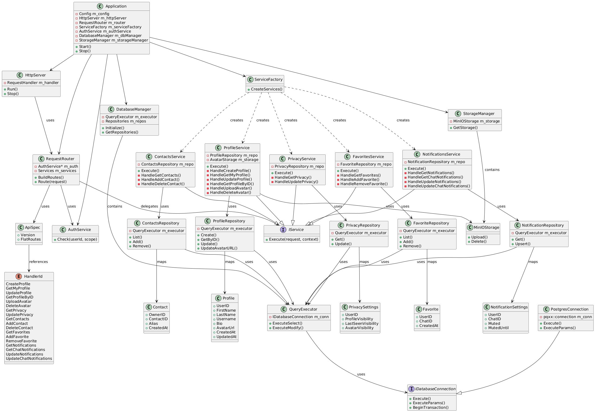

**To build and run use Docker Compose:**

```docker compose up -d --build```

**Tests**

*Run tests*

From the project root:

Configure and build:

```cmake -S . -B build```

```cmake --build build -- -j$(nproc)```

Run all tests:

```ctest --test-dir build```

Run individual test executables:

```api_spec_boost```

```api_spec_catch2```

```api_spec_gtest```

**Project structure**

